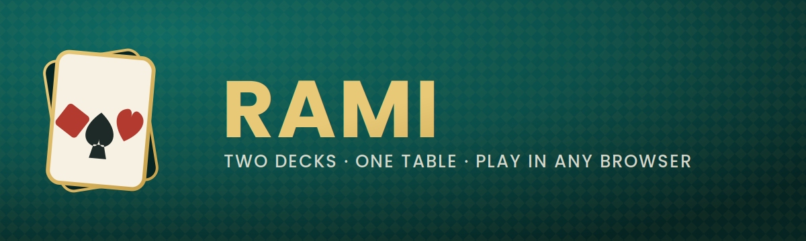

<p align="center">
  
</p>

<p align="center">
  A hotseat <strong>Rami</strong> (Rummy) card game that runs entirely in one HTML file —
  no build step, no server, no install.
</p>

<p align="center">
  
</p>

---

## What is this?

`rami.html` is a complete, self-contained implementation of **Rami**, the two-deck
rummy game popular across North Africa and the Middle East. Open the file in any
browser and play — locally, hotseat-style, with 2 to 7 players, any mix of humans
and bot opponents.

Everything — game logic, styling, and even the app icons — lives inside the single
`rami.html` file, so it can be shared, downloaded, or hosted as-is.

## Features

- **2–7 players**, dealt from a full 108-card double deck (two 54-card decks, jokers included).
- **Bot opponents** — mark any seat as bot-controlled and the computer will draw, arrange, and discard for itself.
- **Free-form hand arrangement** — drag cards anywhere in your hand, or select a card and tap where it should go. Cards slot in exactly where you drop them, not just at the end of a row.
- **Build melds visually** — group cards into a *trio* or *suivie* and watch a live tag confirm whether the group is valid.
- **Discard by dragging onto the pile** — no separate "throw" zone; the discard pile itself is the drop target.
- **Tournante rule** — the dealer's first discard can be freely drawn by the very next player only; after that the pile locks.
- **Win off the discard** — even after the pile locks, any player may pick up the top discard specifically to attempt an immediate win; if it doesn't complete a valid hand, it must be returned.
- **Finish whenever you want** — the Finish button is always available; it validates your hand (at least one joker-free trio and one joker-free suivie) and simply tells you if it's not a win yet.
- **One joker per combination** — jokers fill gaps, but no group may contain more than one.
- **Installable** — includes a favicon, Apple touch icon, and web app manifest baked in, so it can be added to a phone's home screen or a desktop as a standalone app.

## Getting started

No installation required.

1. Download `rami.html`.
2. Open it in any modern browser (Chrome, Safari, Firefox, Edge).
3. Choose the number of players, name each seat, tick "Bot-controlled" for any seat you want the computer to play, and deal.

### Installing it as an app

- **Desktop (Chrome/Edge):** open `rami.html`, then use the browser's "Install app" / "Create shortcut" option. The card icon will show up as the app icon.
- **Mobile (iOS/Android):** open the file in your browser, then use "Add to Home Screen." It will launch full-screen with its own icon, using the embedded manifest and touch icon.

## How to play

Each player is dealt 14 cards; the dealer gets 15.

1. The dealer opens the round by discarding one card face up — the **tournante**.
2. Only the player immediately after the dealer may draw that tournante for free, instead of drawing from the stock. After that, the discard pile locks: no more free draws from it.
3. On your turn: draw a card, then arrange your hand.
   - Drag cards to reorder them, or group them into melds.
   - **Suivie** — 3 or more consecutive cards, all the same suit.
   - **Trio** — 3 or 4 cards of the same rank, each a different suit.
   - A joker can stand in for any missing card, but **no group may contain more than one joker**.
4. Either discard a card (drag it onto the discard pile) to end your turn, or hit **Finish**.
5. Finishing requires all 14 of your other cards arranged into valid groups, with **at least one trio and one suivie built without any joker**, and exactly one card left over to throw face down.
6. **Winning off the discard:** once the tournante is gone, the pile isn't fully dead — you may still pick up the top card if, and only if, it completes your win right away (and lands in a joker-free group). If you pick it up and can't finish, you must return it before doing anything else.

## Project structure

```
rami.html            The entire game — markup, styles, and game logic in one file
README.md            This file
assets/
  logo.svg           Full detail app icon (vector)
  icon-simple.svg     Simplified mark, used for small favicon sizes
  icon-512.png        512×512 PWA icon
  icon-192.png        192×192 PWA icon
  apple-touch-icon.png 180×180 icon for iOS home screen
  favicon.ico         Multi-resolution browser favicon (16/32/48/64)
  banner.svg / .png   README header banner
```

The icons in `assets/` are also embedded directly inside `rami.html` as base64
data URIs (favicon, touch icon, and manifest), so the game stays a single
portable file — the `assets/` folder is there for reference, and for anywhere
else in the repo that wants the artwork (README, store listing, etc).

## Tech

Plain HTML, CSS, and vanilla JavaScript — no framework, no build tools, no
dependencies. All rendering is done with template strings and a single
`render()` call after each state change.

## Notes on house rules

A couple of judgment calls were made where common Rami rules vary by region:

- Ace is low only (no wrap-around run through King–Ace–Two).
- If the stock runs out, older discards are reshuffled back into the stock.
- Groups are capped at one joker each.

Feel free to open the file and adjust `analyzeGroup` / `validateFinish` in the
`<script>` if your table plays by different conventions.

## License

Use it, fork it, deal it out to your friends.
